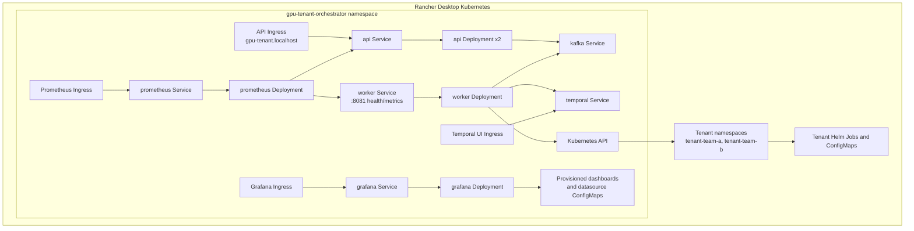

# GPU Tenant Orchestrator

## Status

GPU Tenant Orchestrator is a local-development prototype for accepting GPU
allocation requests, queueing them through Kafka, and executing tenant workload
deployments through Temporal and Helm.

The repository is suitable for local experimentation and unit-test driven
iteration. It is not production-ready until the production readiness checklist
in this document is completed.

## Problem Statement

GPU tenants need a simple ingress path for requesting standard allocation
profiles. The orchestrator provides an API boundary, durable event handoff, and
workflow execution layer so the request path is separated from the Kubernetes
deployment path.

## Goals

- Accept validated tenant GPU allocation requests over HTTP.
- Normalize request data before publishing it to Kafka.
- Consume allocation events and start a Temporal workflow per tenant request.
- Execute a Helm upgrade/install for the tenant workload chart.
- Support local development with Rancher Desktop Kubernetes, unit tests, and
  mock GPU mode.

## Non-Goals

- GPU cluster autoscaling.
- Billing, quota enforcement, or approval workflows.
- Multi-cloud placement decisions.
- Production identity, authorization, and audit systems.
- Full Slurm or Kubernetes operator lifecycle management.

## Architecture

```mermaid
flowchart LR
    Client[Client] -->|POST /api/v1/tenant/allocate| API[FastAPI API]
    API -->|produce confirmed allocation event| Kafka[(Kafka topic<br/>gpu-allocations)]
    Kafka --> Dispatcher[Worker<br/>KafkaWorkflowDispatcher]
    Dispatcher -->|start workflow| Temporal[Temporal<br/>GPUAllocationWorkflow]
    Temporal --> Activity[run_helm_deploy activity]
    Activity --> Helm[Helm upgrade/install]
    Helm --> Namespace[Tenant namespace<br/>tenant-{customer_id}]
    Namespace --> ConfigMap[Tenant ConfigMap<br/>submit_job.sh]
    Namespace --> Job[Tenant submitter Job]
    Dispatcher -->|invalid event or workflow-start failure| DLQ[(Kafka topic<br/>gpu-allocations-dlq)]
    API -->|/metrics| Prometheus[Prometheus]
    Dispatcher -->|/metrics<br/>customer, tier, GPU, duration| Prometheus
    Prometheus --> Grafana[Grafana dashboard]
```



## Component Design

| Component | Path | Responsibility |
| --- | --- | --- |
| API gateway | `src/api/main.py` | Validates tenant input and publishes allocation events to Kafka. |
| Shared config | `src/shared/config.py` | Reads runtime configuration from environment variables. |
| Kafka dispatcher and worker | `src/temporal/worker.py` | Owns Kafka consumer lifecycle, starts Temporal workflows on the worker event loop, exposes worker health/metrics, and routes failed events to the DLQ. |
| Workflow | `src/temporal/workflows.py` | Defines the `GPUAllocationWorkflow` orchestration boundary. |
| Activity | `src/temporal/activities.py` | Validates deployment data and runs Helm. |
| Tenant chart | `helm/tenant-workload` | Creates the workload submitter ConfigMap and Job. |
| Rancher Desktop Kubernetes stack | `deploy/kubernetes/rancher-desktop/*.yaml` | Runs the production-like local environment in Kubernetes with in-cluster RBAC. |
| Local deployment helper | `scripts/local-kubernetes-deploy.sh` | Builds images and starts, stops, checks, or tails the local Kubernetes stack. |

## Kubernetes Manifest Layout

The Rancher Desktop stack is split by Kubernetes resource type:

| File | Resource group |
| --- | --- |
| `deploy/kubernetes/rancher-desktop/00-namespace.yaml` | Platform namespace. |
| `deploy/kubernetes/rancher-desktop/10-configmaps.yaml` | App runtime config and Prometheus config. |
| `deploy/kubernetes/rancher-desktop/20-serviceaccounts.yaml` | API and worker service accounts. |
| `deploy/kubernetes/rancher-desktop/30-roles.yaml` | Worker Helm ClusterRole. |
| `deploy/kubernetes/rancher-desktop/31-rolebindings.yaml` | Worker ClusterRoleBinding. |
| `deploy/kubernetes/rancher-desktop/35-services.yaml` | Kafka, Temporal, API, worker, Prometheus, and Grafana Services. |
| `deploy/kubernetes/rancher-desktop/40-deployments.yaml` | Kafka, Temporal, API, worker, Prometheus, and Grafana Deployments. |
| `deploy/kubernetes/rancher-desktop/70-ingress.yaml` | API, Temporal UI, Prometheus, and Grafana Ingresses. |

## Request Flow

1. A client sends a tenant allocation request to the FastAPI service.
2. The API validates `customer_id` and `tier`.
3. The API publishes a normalized event to Kafka and waits for delivery
   confirmation before returning `202`.
4. The worker dispatcher ensures the primary and DLQ Kafka topics exist before subscribing.
5. The worker dispatcher consumes the Kafka event and validates the message shape.
6. The worker starts a Temporal workflow with ID `gpu-alloc-{customer_id}` and
   waits for the workflow result before committing the Kafka offset.
7. The workflow runs the Helm deployment activity.
8. The activity maps the tenant tier to a GPU count and resolves the tenant namespace.
9. The activity runs `helm upgrade --install`, optionally creating the namespace.
10. The Helm chart creates a tenant-specific Kubernetes Job and ConfigMap.
11. Invalid events and workflow-start failures are published to `KAFKA_DLQ_TOPIC`.

## API Contract

### Allocate Tenant GPU Workload

```http
POST /api/v1/tenant/allocate
Content-Type: application/json
```

Request:

```json
{
  "customer_id": "team-a",
  "tier": "premium"
}
```

Accepted tiers:

| Tier | GPU count |
| --- | ---: |
| `premium` | 2 |
| `standard` | 1 |

`customer_id` must be Kubernetes-safe:

- 1 to 38 characters.
- Lowercase letters, numbers, and internal hyphens.
- Must start and end with a lowercase letter or number.

Success response:

```json
{
  "status": "Accepted",
  "message": "GPU Allocation event sent to queue."
}
```

Common error responses:

| Status | Reason |
| --- | --- |
| `400` | Unsupported tier. |
| `422` | Invalid request shape or invalid `customer_id`. |
| `500` | Kafka publish failure. |

## Configuration

| Variable | Default | Description |
| --- | --- | --- |
| `KAFKA_BOOTSTRAP_SERVERS` | `localhost:9092` | Kafka bootstrap servers used by the API producer and worker consumer. |
| `KAFKA_TOPIC` | `gpu-allocations` | Kafka topic for allocation events. |
| `KAFKA_DLQ_TOPIC` | `gpu-allocations-dlq` | Dead-letter topic for invalid events and workflow-start failures. |
| `KAFKA_TOPIC_PARTITIONS` | `1` | Partition count used when the worker creates missing Kafka topics. |
| `KAFKA_TOPIC_REPLICATION_FACTOR` | `1` | Replication factor used when the worker creates missing Kafka topics. |
| `KAFKA_STARTUP_RETRY_SECONDS` | `5` | Backoff between worker Kafka initialization retries. |
| `KAFKA_PRODUCER_FLUSH_TIMEOUT_SECONDS` | `10` | API timeout while waiting for Kafka delivery confirmation before returning `202`. |
| `TEMPORAL_HOST` | `localhost:7233` | Temporal frontend address used by the worker. |
| `TEMPORAL_CONNECT_TIMEOUT_SECONDS` | `10` | Timeout for each worker Temporal connection attempt. |
| `TEMPORAL_STARTUP_RETRY_SECONDS` | `5` | Backoff between worker Temporal connection retries. |
| `HELM_DRY_RUN` | `false` | Render Helm manifests with `helm template` instead of installing them. The local Kubernetes stack sets this to `false`. |
| `HELM_NAMESPACE` | `default` | Fallback Kubernetes namespace for tenant Helm releases. |
| `HELM_NAMESPACE_TEMPLATE` | empty | Optional namespace template. The local stack uses `tenant-{customer_id}`. |
| `HELM_CREATE_NAMESPACE` | `false` | Adds `--create-namespace` to Helm install/upgrade when true. |
| `HELM_MOCK_GPU` | `true` | Requests CPU instead of `nvidia.com/gpu` in the tenant chart when true. |
| `HELM_KUBE_APISERVER` | empty | Optional explicit Kubernetes API server passed to Helm. The Rancher Desktop stack sets this to its reachable in-pod API endpoint. |
| `HELM_KUBE_TLS_SERVER_NAME` | empty | Optional Kubernetes API TLS server name passed to Helm. |
| `HELM_KUBE_CA_FILE` | empty | Optional Kubernetes API CA file passed to Helm. |
| `HELM_KUBE_TOKEN_FILE` | empty | Optional service-account token file read by the worker and passed to Helm. |
| `HELM_KUBE_INSECURE_SKIP_TLS_VERIFY` | `false` | Optional Helm TLS verification bypass. Keep this disabled outside short-lived local troubleshooting. |
| `WORKER_HEALTH_HOST` | `0.0.0.0` | Worker health server bind address. |
| `WORKER_HEALTH_PORT` | `8081` | Worker health and metrics server port. |

## Local Prerequisites

- Python 3.11 or newer.
- Rancher Desktop with Kubernetes enabled.
- Docker CLI using the Rancher Desktop Docker context.
- `kubectl` context set to `rancher-desktop`.
- Docker context set to `rancher-desktop`.
- Helm, if running Helm commands directly from the host.

For local development without a GPU cluster, the Helm chart defaults to
`mockGpu: true`, which requests CPU instead of `nvidia.com/gpu` and validates
the submitter path without requiring a Slurm cluster.

## Run Locally With Rancher Desktop Kubernetes

This is the only supported local runtime path for the project. API, worker,
Kafka, Temporal, Prometheus, and Grafana run as Kubernetes workloads in the
`gpu-tenant-orchestrator` namespace. Tenant allocation requests create real
Helm releases in `tenant-*` namespaces with `mockGpu=true`, so no physical GPU
or Slurm cluster is required.

### 1. Start Rancher Desktop

In Rancher Desktop settings:

- Enable Kubernetes.
- Enable Traefik.
- Use the `rancher-desktop` Docker context.
- Use the `rancher-desktop` Kubernetes context.

Verify the contexts:

```bash
docker context show
kubectl config current-context
```

Both commands should print `rancher-desktop`.

### 2. Start The Full Stack

Run one command from the repository root:

```bash
./scripts/local-kubernetes-deploy.sh up
```

The command builds fresh local API and worker images, applies the Kubernetes
manifests, rolls the deployments, and waits for the stack to become ready.
Set `IMAGE_TAG=dev` if you want deterministic image tags while iterating:

```bash
IMAGE_TAG=dev ./scripts/local-kubernetes-deploy.sh up
```

### 3. Open The Local URLs

Rancher Desktop exposes the Traefik Ingress through localhost. After `up`
finishes, these URLs should work directly:

| Service | URL |
| --- | --- |
| API | `http://gpu-tenant.localhost` |
| Temporal UI | `http://temporal.gpu-tenant.localhost` |
| Grafana | `http://grafana.gpu-tenant.localhost` with `admin/admin` |
| Prometheus | `http://prometheus.gpu-tenant.localhost` |

Health and metrics:

| Component | URL |
| --- | --- |
| API health | `http://gpu-tenant.localhost/healthz` |
| API readiness | `http://gpu-tenant.localhost/readyz` |
| API metrics | `http://gpu-tenant.localhost/metrics` |
| Worker health | `http://worker:8081/healthz` inside the cluster |
| Worker readiness | `http://worker:8081/readyz` inside the cluster |
| Worker metrics | `http://worker:8081/metrics` inside the cluster |

### 4. Send A Tenant Allocation Request

Submit a premium allocation:

```bash
curl -i -X POST http://gpu-tenant.localhost/api/v1/tenant/allocate \
  -H "Content-Type: application/json" \
  -d '{"customer_id":"team-a","tier":"premium"}'
```

Submit a standard allocation:

```bash
curl -i -X POST http://gpu-tenant.localhost/api/v1/tenant/allocate \
  -H "Content-Type: application/json" \
  -d '{"customer_id":"team-b","tier":"standard"}'
```

Expected success response:

```json
{"status":"Accepted","message":"GPU Allocation event sent to queue."}
```

### 5. Verify The Workflow Result

Check platform status:

```bash
./scripts/local-kubernetes-deploy.sh status
```

Check the tenant namespace and mock submitter job:

```bash
kubectl get namespace tenant-team-a
kubectl -n tenant-team-a get configmaps,jobs,pods
```

Check Kafka topics:

```bash
kubectl -n gpu-tenant-orchestrator exec deployment/kafka -- \
  /opt/kafka/bin/kafka-topics.sh \
  --bootstrap-server 127.0.0.1:29092 \
  --list
```

Read the DLQ topic:

```bash
kubectl -n gpu-tenant-orchestrator exec deployment/kafka -- \
  /opt/kafka/bin/kafka-console-consumer.sh \
  --bootstrap-server 127.0.0.1:29092 \
  --topic gpu-allocations-dlq \
  --from-beginning \
  --timeout-ms 5000
```

### 6. Follow Logs

```bash
./scripts/local-kubernetes-deploy.sh logs-api
./scripts/local-kubernetes-deploy.sh logs-worker
./scripts/local-kubernetes-deploy.sh logs-kafka
```

### 7. Stop And Clean Up

```bash
./scripts/local-kubernetes-deploy.sh down
```

The `down` command deletes the platform namespace and local `tenant-*`
namespaces created by Helm during allocation tests.

### Troubleshooting Local URLs

`http://gpu-tenant.localhost` and the dashboard URLs depend on Rancher
Desktop's Traefik Ingress being exposed on host port `80`.

If the browser or curl returns plain text `404 page not found`, the request
reached an HTTP router but did not reach this FastAPI application. FastAPI 404
responses are JSON and look like `{"detail":"Not Found"}`.

Check what owns host port `80`:

```bash
lsof -nP -iTCP:80 -sTCP:LISTEN
```

On Rancher Desktop for macOS, the listener may show up as `ssh`; that can be
Rancher Desktop's own port-forwarding process. Do not kill it unless you are
intentionally resetting Rancher Desktop, because it can also carry the
Kubernetes API tunnel used by `kubectl`.

If the URLs do not route after `up`:

```bash
kubectl -n gpu-tenant-orchestrator get pods,svc,ingress
kubectl -n gpu-tenant-orchestrator describe ingress api temporal-ui grafana prometheus
curl -i -H "Host: gpu-tenant.localhost" http://127.0.0.1/readyz
```

If `kubectl` reports `127.0.0.1:6443 refused`, restart Rancher Desktop from the
UI, wait for Kubernetes to become ready, then run:

```bash
./scripts/local-kubernetes-deploy.sh up
```

As a temporary fallback only, bypass Ingress and call the API service directly:

```bash
kubectl -n gpu-tenant-orchestrator port-forward svc/api 18000:8000
curl -i http://127.0.0.1:18000/readyz
```

## Uninstall Local Environment

Stop all local Kubernetes services:

```bash
./scripts/local-kubernetes-deploy.sh down
```

The `down` command deletes the platform namespace and local `tenant-*`
namespaces created by Helm during allocation tests.

Remove the local Python environment:

```bash
rm -rf venv
```

Optional cleanup if you built local API or worker images manually:

```bash
docker image rm gpu-tenant-orchestrator-api gpu-tenant-orchestrator-worker
```

## Tests

Install dev dependencies:

```bash
venv/bin/python -m pip install -r requirements-dev.txt
```

Run unit tests:

```bash
venv/bin/python -m pytest
```

The tests mock Kafka publishing and Helm execution, so they do not require
Kafka, Temporal, Kubernetes, or Helm to be running.

Current coverage focus:

- FastAPI request validation and Kafka publish behavior.
- API metrics counters.
- Tier-to-GPU allocation rules.
- Helm command construction.
- Tenant namespace resolution.
- Worker metrics and DLQ routing.
- Invalid deployment input handling.
- Helm failure propagation.

## Docker Images

Build the API image:

```bash
docker build -f Dockerfile.api -t gpu-tenant-orchestrator-api .
```

Build the worker image:

```bash
docker build -f Dockerfile.worker -t gpu-tenant-orchestrator-worker .
```

The worker image includes Helm. The API image does not. Both application images
run as a non-root user, and base images are pinned by digest in both
Dockerfiles.

## Helm Deployment Design

The chart at `helm/tenant-workload` creates:

- A tenant-specific ConfigMap containing `submit_job.sh`.
- A tenant-specific Kubernetes Job that runs the Slurm client container.

Important values:

| Value | Default | Description |
| --- | --- | --- |
| `customerId` | `default-user` | Tenant identifier used in resource names and labels. |
| `tier` | `standard` | Tenant tier label. |
| `gpuCount` | `1` | Requested GPU count. |
| `image` | `alpine:3.20` | Local mock workload image. Override with the approved Slurm client image for production. |
| `imagePullPolicy` | `IfNotPresent` | Pull policy for the tenant workload image. |
| `mockGpu` | `true` | Uses CPU requests and a no-op submit path when true; uses `nvidia.com/gpu` and submits to Slurm when false. |
| `mockCpu` | `250m` | CPU request and limit used for local mock GPU mode. |

## Observability

The local stack includes Prometheus and Grafana configuration under
`deploy/monitoring`.

Current state:

- Prometheus scrapes itself, the API `/metrics` endpoint, and the worker
  `/metrics` endpoint.
- API metrics include request, publish success, and publish failure counters.
- Worker metrics include dispatcher readiness, Temporal worker readiness, Kafka
  processed message count, invalid message count, DLQ count, workflow-start
  failure count, per-customer allocation counts, per-customer GPU count,
  allocation duration, and completion status.
- Grafana provisions the `GPU Tenant Orchestrator Metrics` dashboard during
  `./scripts/local-kubernetes-deploy.sh up`.
- API and worker logs are plain stdout/stderr logs.

Useful Prometheus queries:

```promql
gpu_tenant_api_allocation_requests_total
gpu_tenant_api_allocation_publish_success_total
gpu_tenant_worker_messages_consumed_total
gpu_tenant_worker_customer_allocations_total
gpu_tenant_worker_customer_allocation_gpu_count
gpu_tenant_worker_customer_allocation_duration_seconds
gpu_tenant_worker_customer_allocations_completed_total
gpu_tenant_worker_dlq_messages_total
```

The Grafana dashboard includes:

- API accepted allocations.
- Kafka messages processed by the worker.
- DLQ event count.
- Last successful allocation duration.
- Total customers.
- Total GPUs allocated.
- Average allocation duration.
- Allocations by tier.
- Customer allocation GPU count table.
- Customer allocation duration table.

## Production Readiness

The current repository should be treated as a prototype. Before production use,
complete the following checklist.

| Area | Current state | Required before production |
| --- | --- | --- |
| Authentication | No API auth. | Add tenant authentication and service-to-service authorization. |
| Authorization | No tenant-level access control. | Enforce tenant ownership and allowed tiers. |
| Kafka security | Local PLAINTEXT config. | Enable TLS/SASL, authenticated producers and consumers, ACLs, and topic retention policy. |
| Temporal security | Local dev server defaults. | Use managed or hardened Temporal with TLS, namespaces, retention, and worker identity. |
| Kubernetes access | Rancher Desktop path uses a worker service account and ClusterRole to create tenant namespaces and Helm resources. | Tighten RBAC with namespace admission controls, tenant namespace ownership, and least-privilege production roles. |
| Idempotency | Workflow ID is tenant-based. | Define duplicate request behavior, retries, and replay-safe semantics. |
| Failure handling | Invalid Kafka messages and workflow-start failures are routed to a DLQ; Helm failures raise to Temporal. | Add retry policy tuning, DLQ replay tooling, operator alerts, and failure reconciliation. |
| Observability | Local Prometheus scrapes API and worker metrics; Grafana is present. | Add structured logs, traces, production dashboards, SLOs, and alerting. |
| Health checks | API and worker expose readiness/liveness endpoints. | Add deeper dependency-aware readiness checks for Kafka and Temporal. |
| Deployment | Dockerfiles and a Rancher Desktop Kubernetes manifest exist. | Split production overlays from local manifests, publish images to a registry, version releases, and define rollout/rollback strategy. |
| Secrets | No secret management. | Use a secrets manager or Kubernetes Secrets with rotation policy. |
| Supply chain | Dependencies and Docker app base images are pinned; app containers run as non-root. | Add vulnerability scanning, SBOM generation, signed images, and base image patch policy. |
| Testing | Unit tests cover core behavior. | Add integration tests with Kafka/Temporal, Helm template tests, and end-to-end deployment tests. |
| Data governance | Minimal event payload. | Define retention, audit fields, PII policy, and request tracing IDs. |

## Public Repository Readiness

This repository includes a public baseline: `LICENSE`, `SECURITY.md`,
`CONTRIBUTING.md`, `.dockerignore`, and a GitHub Actions workflow at
`.github/workflows/ci.yml`.

Before making this repository public, complete this checklist.

| Area | Required action |
| --- | --- |
| Secrets | Run a full secret scan across history before publishing. |
| Internal references | Remove private hostnames, cluster names, credentials, tickets, and organization-only context. |
| License | Confirm the MIT license and copyright holder are correct. |
| Security policy | Replace the placeholder reporting channel in `SECURITY.md` with the real private contact path. |
| Contributions | Review `CONTRIBUTING.md` and adjust workflow expectations for the target repository. |
| Code of conduct | Add a `CODE_OF_CONDUCT.md` if accepting external contributions. |
| CI | GitHub Actions runs tests and static validation. Add dependency checks, linting, and Docker builds when publishing images. |
| Dependency posture | Add dependency update automation and vulnerability alerts. |
| Documentation | Keep local run, teardown, test, API, metrics, and architecture sections current. |
| Sample config | Provide safe example environment files only; do not commit real credentials. |
| Generated files | Ensure caches, local virtual environments, logs, and build artifacts are ignored. |
| Images | Avoid publishing unscanned images; document supported tags and architectures. |

Suggested pre-publication commands:

```bash
git status --short
venv/bin/python -m pytest -q
venv/bin/python -m py_compile \
  src/api/main.py \
  src/shared/config.py \
  src/temporal/activities.py \
  src/temporal/worker.py \
  src/temporal/workflows.py
bash -n scripts/local-kubernetes-deploy.sh
jq empty deploy/monitoring/grafana/dashboards/gpu-tenant-metrics.json
kubectl apply --dry-run=client -f deploy/kubernetes/rancher-desktop
docker build -f Dockerfile.api -t gpu-tenant-orchestrator-api .
docker build -f Dockerfile.worker -t gpu-tenant-orchestrator-worker .
```

Use a dedicated secret scanning tool, such as `gitleaks` or `detect-secrets`,
before publishing the repository or its history.

## Recently Closed Gaps

- The API waits for Kafka delivery confirmation before returning `202`.
- The worker exposes `/healthz`, `/readyz`, and `/metrics`.
- Kafka consumption is owned by a `KafkaWorkflowDispatcher` lifecycle wrapper.
- The worker provisions the primary and DLQ Kafka topics during startup and
  retries initialization when Kafka is temporarily unavailable.
- Helm can target tenant-specific namespaces with `HELM_NAMESPACE_TEMPLATE`.
- Invalid Kafka messages and workflow-start failures are routed to
  `KAFKA_DLQ_TOPIC`.
- Prometheus scrapes API and worker application metrics.
- Grafana dashboards and datasource are provisioned during local deployment.
- Docker app base images are pinned by digest and app containers run as
  non-root users.
